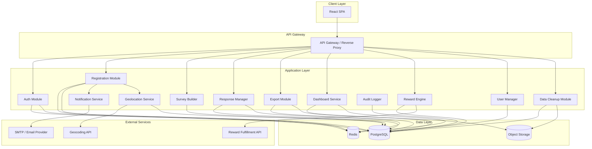
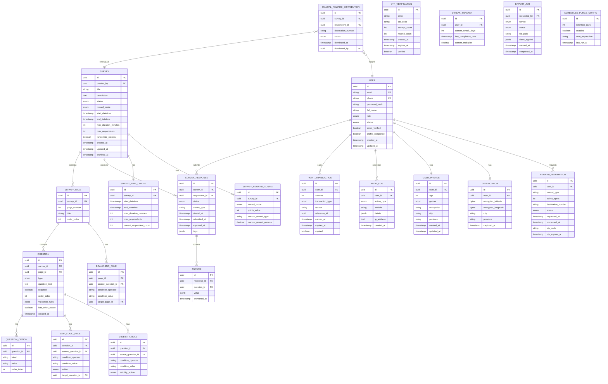

# Dokumen Desain Teknis - Sistem Survei Online

## Overview

Sistem Survei Online adalah aplikasi web full-stack yang memungkinkan organisasi membuat survei, mengumpulkan respons dari responden yang terdaftar mandiri, dan menganalisis data melalui dashboard interaktif. Sistem ini mencakup mekanisme reward (otomatis via poin dan manual), kontrol akses berbasis peran (RBAC), audit logging, geolokasi, dan manajemen siklus hidup data.

### Keputusan Desain Utama

| Keputusan | Pilihan | Alasan |
|-----------|---------|--------|
| Arsitektur | Monolith modular (backend) + SPA (frontend) | Kompleksitas moderat, tim kecil-menengah, deployment sederhana |
| Backend Framework | Node.js + Express/NestJS | Ekosistem luas, TypeScript support, async I/O untuk notifikasi |
| Frontend Framework | React + TypeScript | Komponen reusable untuk survey builder, state management matang |
| Database | PostgreSQL | Relational integrity untuk RBAC, constraint unik, JSON support untuk survey schema |
| Cache | Redis | Session management, OTP storage, rate limiting, real-time dashboard |
| Queue | Bull/BullMQ (Redis-backed) | Email notifications, export jobs, scheduled tasks |
| File Storage | S3-compatible (MinIO/AWS S3) | Upload file survei, export files |
| Geolocation | Nominatim/Google Maps Geocoding API | Reverse geocoding untuk koordinat GPS |
| Charts | Chart.js / Recharts (frontend) | Bar, line, pie/donut charts |
| Maps | Leaflet + heatmap plugin | Heat map distribusi geografis |

## Architecture

### Diagram Arsitektur Tingkat Tinggi



### Pola Arsitektur

1. **Modular Monolith**: Setiap modul memiliki boundary yang jelas dengan interface yang terdefinisi. Memungkinkan migrasi ke microservices di masa depan jika diperlukan.

2. **Event-Driven untuk Side Effects**: Operasi utama mempublikasikan event yang dikonsumsi oleh Audit Logger dan Notification Service secara asinkron melalui message queue.

3. **CQRS Ringan untuk Dashboard**: Query dashboard menggunakan materialized views/cache terpisah dari write path untuk performa real-time.

4. **Repository Pattern**: Akses data melalui repository abstraction untuk testability dan separation of concerns.

## Components and Interfaces

### 1. Auth Module (Modul Autentikasi)

**Tanggung Jawab**: Login, logout, session management, password reset, JWT token management.

```typescript
interface AuthModule {
  login(email: string, password: string): Promise<AuthResult>;
  logout(sessionId: string): Promise<void>;
  refreshToken(refreshToken: string): Promise<TokenPair>;
  requestPasswordReset(email: string): Promise<void>;
  resetPassword(token: string, newPassword: string): Promise<void>;
  validateSession(token: string): Promise<SessionInfo>;
}

interface AuthResult {
  accessToken: string;
  refreshToken: string;
  user: UserProfile;
}
```

### 2. Registration Module (Modul Registrasi)

**Tanggung Jawab**: Self-registration, OTP generation/verification, profile completion.

```typescript
interface RegistrationModule {
  register(data: RegistrationData): Promise<RegistrationResult>;
  sendOtp(email: string): Promise<OtpResult>;
  verifyOtp(email: string, code: string): Promise<VerificationResult>;
  completeProfile(userId: string, profile: ProfileData): Promise<void>;
  resendOtp(email: string): Promise<OtpResult>;
}

interface RegistrationData {
  fullName: string;
  email: string;
  phone: string;
  password: string;
  termsAccepted: boolean;
}

interface ProfileData {
  age: number;
  gender: 'male' | 'female' | 'other';
  occupation: string;
  city: string;
  province: string;
  latitude?: number;
  longitude?: number;
}
```

### 3. Survey Builder

**Tanggung Jawab**: CRUD survei, manajemen pertanyaan, konfigurasi logika, validasi.

```typescript
interface SurveyBuilder {
  createSurvey(data: SurveyCreateData): Promise<Survey>;
  updateSurvey(id: string, data: SurveyUpdateData): Promise<Survey>;
  duplicateSurvey(id: string): Promise<Survey>;
  deactivateSurvey(id: string): Promise<void>;
  deleteSurvey(id: string): Promise<void>;
  archiveSurvey(id: string): Promise<void>;
  
  addQuestion(surveyId: string, question: QuestionData): Promise<Question>;
  updateQuestion(questionId: string, data: QuestionData): Promise<Question>;
  deleteQuestion(questionId: string): Promise<void>;
  reorderQuestions(surveyId: string, order: string[]): Promise<void>;
  
  setSkipLogic(questionId: string, rules: SkipLogicRule[]): Promise<void>;
  setConditionalVisibility(questionId: string, rules: VisibilityRule[]): Promise<void>;
  setPageBranching(pageId: string, rules: BranchingRule[]): Promise<void>;
}

interface SurveyCreateData {
  title: string;
  description?: string;
  startDateTime: Date;
  endDateTime: Date;
  maxDuration?: number; // minutes
  maxRespondents?: number;
  rewardMode: 'automatic' | 'manual';
  rewardConfig: AutomaticRewardConfig | ManualRewardConfig;
  randomizeOptions?: boolean;
}

interface QuestionData {
  type: QuestionType;
  text: string;
  required: boolean;
  page: number;
  order: number;
  options?: QuestionOption[];
  validation?: ValidationRule[];
  hasOtherOption?: boolean;
}

type QuestionType = 
  | 'single_choice' 
  | 'multiple_choice' 
  | 'short_text' 
  | 'long_text' 
  | 'phone_number'
  | 'numeric_scale' 
  | 'dropdown' 
  | 'matrix_likert' 
  | 'file_upload' 
  | 'date_time';
```

### 4. Response Manager (Manajer Respons)

**Tanggung Jawab**: Menerima, menyimpan, memfilter respons survei; enforce one-response-per-survey.

```typescript
interface ResponseManager {
  submitResponse(surveyId: string, respondentId: string, answers: Answer[]): Promise<ResponseResult>;
  saveProgress(surveyId: string, respondentId: string, answers: Answer[]): Promise<void>;
  getResponses(surveyId: string, filters: ResponseFilter): Promise<PaginatedResponses>;
  getRespondentResponse(surveyId: string, respondentId: string): Promise<SurveyResponse | null>;
  getManualRewardRecipients(surveyId: string): Promise<ManualRewardRecipient[]>;
  markRewardDistributed(surveyId: string, respondentIds: string[]): Promise<void>;
}

interface ResponseFilter {
  dateRange?: { start: Date; end: Date };
  region?: string;
  profileAttributes?: Record<string, any>;
  completionStatus?: 'complete' | 'in_progress' | 'abandoned';
  deviceType?: 'mobile' | 'desktop' | 'tablet';
  tags?: string[];
}
```

### 5. Export Module (Modul Export)

**Tanggung Jawab**: Generate export dalam berbagai format, apply filters, mark exported data.

```typescript
interface ExportModule {
  exportCsv(surveyId: string, filters: ResponseFilter): Promise<ExportJob>;
  exportExcel(surveyId: string, filters: ResponseFilter): Promise<ExportJob>;
  exportPdf(surveyId: string, filters: ResponseFilter): Promise<ExportJob>;
  exportJson(surveyId: string, filters: ResponseFilter): Promise<ExportJob>;
  exportAuditLog(filters: AuditFilter): Promise<ExportJob>;
  extractManualRewardData(surveyId: string): Promise<ExportJob>;
  getExportStatus(jobId: string): Promise<ExportStatus>;
  downloadExport(jobId: string): Promise<ReadableStream>;
}
```

### 6. Dashboard Service

**Tanggung Jawab**: Agregasi metrik, generate chart data, real-time statistics.

```typescript
interface DashboardService {
  getOverviewMetrics(): Promise<OverviewMetrics>;
  getRegistrationChart(period: DateRange): Promise<ChartData>;
  getCumulativeTrendChart(period: DateRange): Promise<ChartData>;
  getDistributionCharts(): Promise<DistributionData>;
  getHeatmapData(): Promise<HeatmapPoint[]>;
  getSurveyCompletionRates(): Promise<SurveyCompletionRate[]>;
}

interface OverviewMetrics {
  registrationsLast24h: number;
  totalRespondents: number;
  activeSurveys: number;
  totalResponses: number;
}
```

### 7. Notification Service (Layanan Notifikasi)

**Tanggung Jawab**: Mengirim email (undangan, pengingat, konfirmasi) secara asinkron.

```typescript
interface NotificationService {
  sendSurveyInvitation(surveyId: string, respondentIds: string[]): Promise<void>;
  sendReminder(surveyId: string, daysBeforeDeadline: number): Promise<void>;
  sendSubmissionConfirmation(respondentId: string, surveyId: string): Promise<void>;
  sendPointsThresholdNotification(respondentId: string): Promise<void>;
  sendRedemptionConfirmation(respondentId: string, redemptionId: string): Promise<void>;
  sendOtpEmail(email: string, otpCode: string): Promise<void>;
  sendPasswordResetEmail(email: string, resetToken: string): Promise<void>;
}
```

### 8. Reward Engine (Mesin Reward)

**Tanggung Jawab**: Akumulasi poin, saldo, kadaluarsa, penukaran, streak tracking.

```typescript
interface RewardEngine {
  creditPoints(respondentId: string, amount: number, reason: PointCreditReason): Promise<void>;
  getBalance(respondentId: string): Promise<PointBalance>;
  getTransactionHistory(respondentId: string, pagination: Pagination): Promise<PointTransaction[]>;
  getRewardCatalog(): Promise<RewardItem[]>;
  initiateRedemption(respondentId: string, rewardId: string, destination: string): Promise<RedemptionResult>;
  confirmRedemption(redemptionId: string, otpCode: string): Promise<RedemptionResult>;
  processExpiredPoints(): Promise<ExpiredPointsSummary>;
  calculateStreak(respondentId: string): Promise<StreakInfo>;
  manualCreditPoints(adminId: string, respondentId: string, amount: number, reason: string): Promise<void>;
}

interface PointBalance {
  total: number;
  available: number;
  pending: number;
  expiringWithin30Days: number;
}

type PointCreditReason = 
  | 'registration' 
  | 'profile_completion' 
  | 'survey_completion' 
  | 'streak_bonus' 
  | 'manual_credit';
```

### 9. Geolocation Service (Layanan Geolokasi)

**Tanggung Jawab**: Collect GPS coordinates, reverse geocoding, encrypted storage.

```typescript
interface GeolocationService {
  captureLocation(respondentId: string, coords: Coordinates): Promise<LocationData>;
  reverseGeocode(coords: Coordinates): Promise<GeocodedAddress>;
  getRespondentLocation(respondentId: string): Promise<LocationData>;
  getHeatmapData(filters?: GeoFilter): Promise<HeatmapPoint[]>;
}

interface Coordinates {
  latitude: number;
  longitude: number;
}

interface LocationData {
  city: string;
  province: string;
  // GPS coordinates stored encrypted, never exposed to other users
}
```

### 10. User Manager (Manajer Pengguna)

**Tanggung Jawab**: CRUD pengguna, role assignment, bulk import, account status.

```typescript
interface UserManager {
  createUser(data: CreateUserData): Promise<User>;
  updateUserRole(userId: string, role: UserRole): Promise<void>;
  activateUser(userId: string): Promise<void>;
  deactivateUser(userId: string): Promise<void>;
  resetUserPassword(userId: string): Promise<void>;
  bulkImportUsers(csvFile: ReadableStream): Promise<BulkImportResult>;
  getUserActivityHistory(userId: string): Promise<ActivityEntry[]>;
  listUsers(filters: UserFilter, pagination: Pagination): Promise<PaginatedUsers>;
}

type UserRole = 'super_admin' | 'admin' | 'analyst' | 'viewer' | 'respondent';
```

### 11. Audit Logger

**Tanggung Jawab**: Mencatat semua event sistem, filter, export log.

```typescript
interface AuditLogger {
  log(event: AuditEvent): Promise<void>;
  query(filters: AuditFilter): Promise<PaginatedAuditEntries>;
  exportLogs(filters: AuditFilter): Promise<ExportJob>;
}

interface AuditEvent {
  userId: string;
  actionType: AuditActionType;
  module: SystemModule;
  details: Record<string, any>;
  ipAddress: string;
  timestamp: Date;
}

type AuditActionType = 
  | 'login' | 'logout'
  | 'survey_create' | 'survey_update' | 'survey_delete' | 'survey_archive'
  | 'question_create' | 'question_update' | 'question_delete'
  | 'notification_sent'
  | 'data_export'
  | 'role_change'
  | 'data_cleanup'
  | 'reward_redemption'
  | 'manual_reward_distribution';
```

### 12. Data Cleanup Module (Modul Pembersihan Data)

**Tanggung Jawab**: Penghapusan terkontrol, arsip, GDPR compliance, scheduled purge.

```typescript
interface DataCleanupModule {
  requestDeletion(request: DeletionRequest): Promise<DeletionResult>;
  confirmDeletion(requestId: string, confirmationToken: string): Promise<void>;
  archiveSurvey(surveyId: string): Promise<void>;
  deletePersonalData(respondentId: string, superAdminApproval: string): Promise<void>;
  getCleanupCandidates(filters: CleanupFilter): Promise<CleanupCandidate[]>;
  configureScheduledPurge(config: PurgeConfig): Promise<void>;
}

interface DeletionRequest {
  surveyId?: string;
  dateRange?: { start: Date; end: Date };
  exportStatus: 'exported_only';
  requireDoubleConfirmation: true;
}
```

## Data Models

### Entity Relationship Diagram



### Constraint Database Penting

```sql
-- Unique constraint: satu respons per survei per responden
ALTER TABLE survey_response 
  ADD CONSTRAINT uq_one_response_per_survey 
  UNIQUE (survey_id, respondent_id);

-- Unique email dan phone
ALTER TABLE users 
  ADD CONSTRAINT uq_user_email UNIQUE (email);
ALTER TABLE users 
  ADD CONSTRAINT uq_user_phone UNIQUE (phone);

-- Index untuk performa query dashboard
CREATE INDEX idx_survey_response_survey_status ON survey_response(survey_id, status);
CREATE INDEX idx_survey_response_submitted_at ON survey_response(submitted_at);
CREATE INDEX idx_point_transaction_user_expires ON point_transaction(user_id, expires_at) WHERE NOT expired;
CREATE INDEX idx_audit_log_created_at ON audit_log(created_at);
CREATE INDEX idx_audit_log_user_action ON audit_log(user_id, action_type);

-- Enkripsi kolom geolokasi menggunakan pgcrypto
-- encrypted_latitude dan encrypted_longitude menggunakan AES-256
```

## Correctness Properties

*A property is a characteristic or behavior that should hold true across all valid executions of a system—essentially, a formal statement about what the system should do. Properties serve as the bridge between human-readable specifications and machine-verifiable correctness guarantees.*

### Property 1: Registration Uniqueness

*For any* two registration attempts with the same email address OR the same phone number, the system SHALL reject the second attempt and only the first registration SHALL exist in the system.

**Validates: Requirements 1.3, 1.4, 1.5, 1.6**

### Property 2: Password Validation

*For any* string, the password validation function SHALL accept it if and only if it contains at least 8 characters, at least 1 uppercase letter, and at least 1 digit.

**Validates: Requirements 1.2**

### Property 3: OTP Round-Trip Verification

*For any* generated OTP code, verifying with the exact same code within 15 minutes of generation SHALL succeed, and verifying with any different code OR after 15 minutes SHALL fail.

**Validates: Requirements 1.7, 1.8, 1.10, 1.11**

### Property 4: Profile Completion Activates Account

*For any* valid profile data (age, gender, occupation, city, province) submitted after email verification, the system SHALL activate the account and mark it as eligible for survey invitations.

**Validates: Requirements 2.4**

### Property 5: Authentication Security

*For any* login attempt, if the credentials match a valid active user then a session SHALL be created; if the credentials do not match (wrong email, wrong password, or both), the system SHALL return the same generic error message regardless of which field is incorrect.

**Validates: Requirements 3.2, 3.3**

### Property 6: RBAC Enforcement

*For any* user with a given role and any system operation, the operation SHALL be permitted if and only if the role has the required permission: only Super_Admin/Admin can create/edit surveys, only Super_Admin/Admin/Analyst can export data, only Super_Admin/Admin can perform data cleanup, and Analyst/Viewer SHALL have read-only access to dashboard.

**Validates: Requirements 5.10, 11.5, 11.6, 11.7**

### Property 7: Survey CRUD Round-Trip

*For any* valid survey data, creating a survey and then reading it back SHALL return equivalent data (title, description, configuration, questions, and options preserved).

**Validates: Requirements 6.1**

### Property 8: Conditional Logic Evaluation

*For any* set of skip logic rules, conditional visibility rules, or page branching rules, and any set of respondent answers, the logic evaluator SHALL correctly determine which questions to skip, which to show/hide, and which page to navigate to, based solely on the condition operators and values defined in the rules.

**Validates: Requirements 6.7, 6.8, 6.9**

### Property 9: Option Randomization Preserves Set

*For any* question with randomization enabled, the randomized option list SHALL contain exactly the same set of options as the original (same elements, possibly different order).

**Validates: Requirements 6.10**

### Property 10: Survey Time Access Control

*For any* survey with configured start and end datetimes, access SHALL be denied when current time is before start_datetime, and new response submissions SHALL be rejected when current time is after end_datetime.

**Validates: Requirements 18.1, 18.2**

### Property 11: Respondent Cap Enforcement

*For any* survey with a configured maximum respondent count N, after N complete responses have been submitted, all subsequent response attempts SHALL be rejected.

**Validates: Requirements 6.4, 18.4**

### Property 12: One Response Per Survey

*For any* respondent who has already submitted a complete response to a survey, any subsequent submission attempt to the same survey SHALL be rejected.

**Validates: Requirements 7.1, 7.2**

### Property 13: Resume In-Progress Response

*For any* respondent with an in-progress response to a survey, accessing that survey SHALL return the existing in-progress response rather than creating a new one.

**Validates: Requirements 7.3**

### Property 14: Response Filter Correctness

*For any* set of filter criteria (date range, region, profile attributes, completion status, device type, tags) applied to a response dataset, every returned response SHALL satisfy ALL specified filter criteria simultaneously.

**Validates: Requirements 8.2, 8.3**

### Property 15: Export Filter Application

*For any* export operation with active filters, the exported dataset SHALL contain only responses that match all active filter criteria.

**Validates: Requirements 9.5**

### Property 16: Export Marks Responses

*For any* successful export operation, all responses included in the export SHALL be marked with an export timestamp.

**Validates: Requirements 9.6**

### Property 17: Export-First Deletion Rule

*For any* deletion request targeting survey responses, the system SHALL permit deletion only for responses that have a non-null export timestamp, and SHALL reject deletion for any response without an export timestamp.

**Validates: Requirements 12.1, 12.2**

### Property 18: GDPR Data Deletion Completeness

*For any* personal data deletion request that has been approved and executed, no personally identifiable information (name, email, phone, location coordinates) SHALL remain associated with the target respondent in the system.

**Validates: Requirements 12.5**

### Property 19: Scheduled Purge Logic

*For any* scheduled purge execution with a configured retention period, only responses that have been exported AND are older than the retention period SHALL be deleted; unexported responses and responses within the retention period SHALL remain untouched.

**Validates: Requirements 12.9**

### Property 20: Point Crediting for Survey Completion

*For any* survey with a configured point value within the allowed range (1,000-3,000 for short surveys, 5,000-15,000 for long surveys), completing that survey SHALL credit exactly the configured point amount to the respondent's balance.

**Validates: Requirements 13.3, 13.4**

### Property 21: Streak Multiplier Calculation

*For any* respondent with a completion streak, points earned SHALL be multiplied by 1.5x if streak is >= 7 days, by 2.0x if streak is >= 30 days, and by 1.0x (no multiplier) if streak is < 7 days.

**Validates: Requirements 13.5, 13.6**

### Property 22: Points Only for Complete Responses

*For any* survey response that is not in 'complete' status (in-progress, abandoned), the reward engine SHALL NOT credit any points to the respondent.

**Validates: Requirements 13.7**

### Property 23: Point Expiration

*For any* point transaction, if 12 months have elapsed since the earned_at date and the points have not been redeemed, the points SHALL be marked as expired and excluded from the available balance.

**Validates: Requirements 14.1**

### Property 24: Points Non-Transferable

*For any* attempt to transfer points from one respondent account to another, the system SHALL reject the operation and both balances SHALL remain unchanged.

**Validates: Requirements 14.2**

### Property 25: Redemption Threshold Enforcement

*For any* redemption attempt where the respondent's available point balance is below 10,000 points OR below the required amount for the selected reward, the system SHALL reject the redemption.

**Validates: Requirements 14.4, 15.5**

### Property 26: Redemption Balance Deduction

*For any* successful redemption of a reward costing P points, the respondent's available balance SHALL decrease by exactly P points (balance_before - P = balance_after).

**Validates: Requirements 15.4**

### Property 27: Audit Entry Completeness

*For any* audit log entry, it SHALL contain all required fields: user_id, action_type, timestamp, module, and ip_address, with no null values for these fields.

**Validates: Requirements 10.2**

### Property 28: Geolocation Encryption

*For any* stored geolocation record, the raw latitude and longitude values in the database SHALL be encrypted (not readable as plain-text coordinates).

**Validates: Requirements 17.3**

### Property 29: GPS Coordinates Privacy

*For any* API response served to a user other than the data owner, the response SHALL NOT contain raw GPS coordinates (latitude/longitude) of any respondent.

**Validates: Requirements 17.5**

### Property 30: Manual Reward Recipient Filter

*For any* survey with manual reward mode, the list of eligible reward recipients SHALL contain only respondents who have fully completed the survey (status = 'complete').

**Validates: Requirements 16.10**

### Property 31: Field Validation Rules

*For any* input value and configured validation rule (required, min/max length, email format, Indonesian phone format, numeric range, regex pattern, max checkbox selections), the validation function SHALL return valid if and only if the input satisfies the rule criteria.

**Validates: Requirements 6.6**

### Property 32: Bulk User Import Round-Trip

*For any* valid CSV file containing user data, importing the file SHALL create users whose attributes (name, email, phone, role) match exactly the data in the CSV rows.

**Validates: Requirements 11.3**

### Property 33: Deactivated Account Login Rejection

*For any* user account with status 'deactivated', login attempts with correct credentials SHALL be rejected.

**Validates: Requirements 11.4**

## Error Handling

### Strategi Error Handling

| Layer | Strategi | Detail |
|-------|----------|--------|
| API Gateway | Rate limiting, request validation | 429 Too Many Requests, 400 Bad Request |
| Authentication | Token expiry, invalid credentials | 401 Unauthorized, 403 Forbidden |
| Business Logic | Domain validation errors | 422 Unprocessable Entity dengan detail error |
| Database | Constraint violations, connection errors | Retry dengan exponential backoff |
| External Services | Timeout, unavailability | Circuit breaker pattern, fallback |
| File Operations | Upload size limits, format validation | 413 Payload Too Large, 415 Unsupported Media Type |

### Error Response Format

```typescript
interface ErrorResponse {
  status: number;
  code: string;           // e.g., "DUPLICATE_EMAIL", "OTP_EXPIRED"
  message: string;        // User-friendly message (Indonesian)
  details?: ErrorDetail[];
  traceId: string;        // For debugging/audit correlation
}

interface ErrorDetail {
  field: string;
  code: string;
  message: string;
}
```

### Penanganan Error Spesifik

1. **Registrasi**
   - Email/phone duplikat → 409 Conflict dengan pesan spesifik
   - OTP expired → 410 Gone, prompt untuk resend
   - OTP max resend → 429 Too Many Requests, tunggu 30 menit

2. **Survei**
   - Survei belum aktif → 403 Forbidden dengan info waktu mulai
   - Survei sudah berakhir → 410 Gone
   - Responden cap tercapai → 410 Gone
   - Duplikat respons → 409 Conflict

3. **Reward**
   - Saldo tidak cukup → 402 Payment Required
   - OTP penukaran gagal → 401 Unauthorized
   - Poin expired → informasi di balance response

4. **Data Cleanup**
   - Data belum diexport → 412 Precondition Failed
   - Tanpa approval Super_Admin → 403 Forbidden
   - Konfirmasi ganda gagal → 428 Precondition Required

5. **External Service Failures**
   - Email service down → Queue untuk retry, log warning
   - Geocoding API timeout → Fallback ke manual input
   - Reward fulfillment API error → Mark as pending, notify admin

### Circuit Breaker Configuration

```typescript
interface CircuitBreakerConfig {
  failureThreshold: 5;        // Open after 5 failures
  successThreshold: 3;        // Close after 3 successes
  timeout: 30000;             // 30 seconds before half-open
  monitoredServices: ['email', 'geocoding', 'reward_fulfillment'];
}
```

## Testing Strategy

### Pendekatan Dual Testing

Sistem ini menggunakan kombinasi unit tests dan property-based tests untuk coverage komprehensif:

- **Unit Tests**: Verifikasi contoh spesifik, edge cases, dan error conditions
- **Property-Based Tests**: Verifikasi universal properties di semua input yang valid
- **Integration Tests**: Verifikasi interaksi antar komponen dan external services

### Property-Based Testing

**Library**: [fast-check](https://github.com/dubzzz/fast-check) (TypeScript/JavaScript)

**Konfigurasi**:
- Minimum 100 iterasi per property test
- Setiap property test mereferensikan property di dokumen desain
- Tag format: **Feature: online-survey-system, Property {number}: {property_text}**

**Properties yang Diimplementasikan sebagai PBT**:
- Property 1-6: Registration, authentication, RBAC
- Property 7-9: Survey builder logic
- Property 10-13: Survey access control dan response management
- Property 14-16: Filter dan export logic
- Property 17-19: Data cleanup logic
- Property 20-26: Reward engine logic
- Property 27-33: Audit, geolocation, validation

### Unit Testing

**Framework**: Jest / Vitest

**Fokus Unit Tests**:
- Contoh spesifik untuk setiap tipe pertanyaan survei
- Edge cases: empty strings, boundary values, null handling
- Error conditions: network failures, timeout scenarios
- UI component rendering (example-based)
- Email template generation
- CSV parsing edge cases

### Integration Testing

**Fokus Integration Tests**:
- Email notification delivery (mock SMTP)
- Geocoding API interaction
- Reward fulfillment API
- Database constraint enforcement
- Scheduled job execution (purge, expiration)
- End-to-end survey flow

### Test Coverage Targets

| Layer | Target |
|-------|--------|
| Business Logic (pure functions) | 90%+ via PBT + unit |
| API Handlers | 80%+ via integration |
| Database Queries | 80%+ via integration |
| UI Components | 70%+ via unit + snapshot |

### Continuous Integration

```yaml
test-pipeline:
  - lint (ESLint + Prettier)
  - type-check (TypeScript)
  - unit-tests (Vitest)
  - property-tests (fast-check, min 100 iterations)
  - integration-tests (with test database)
  - e2e-tests (Playwright, critical paths)
```

